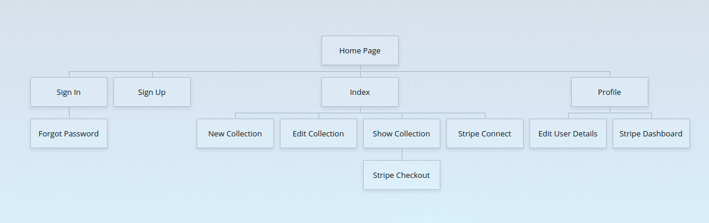
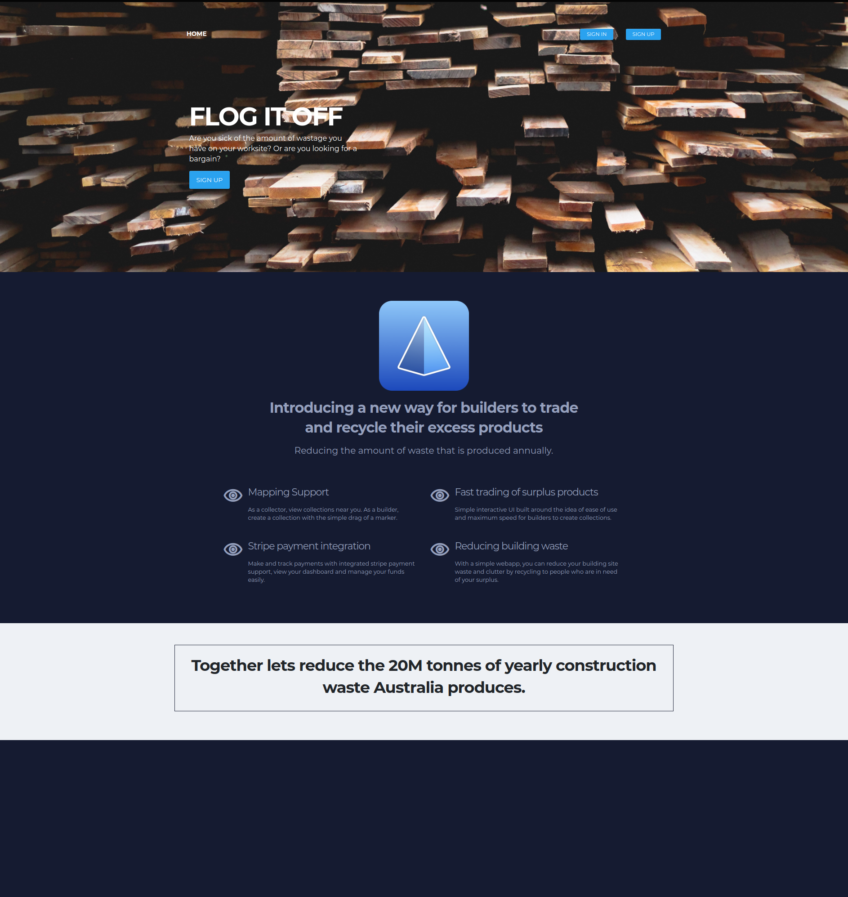
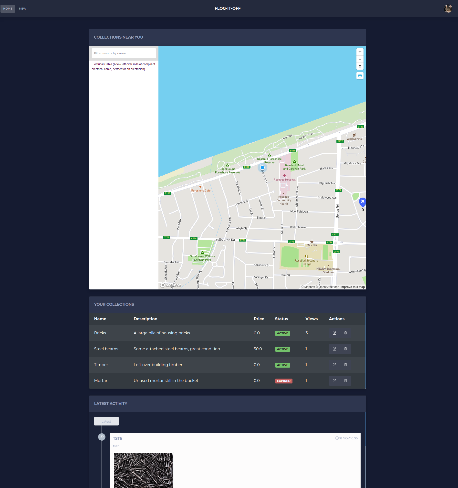
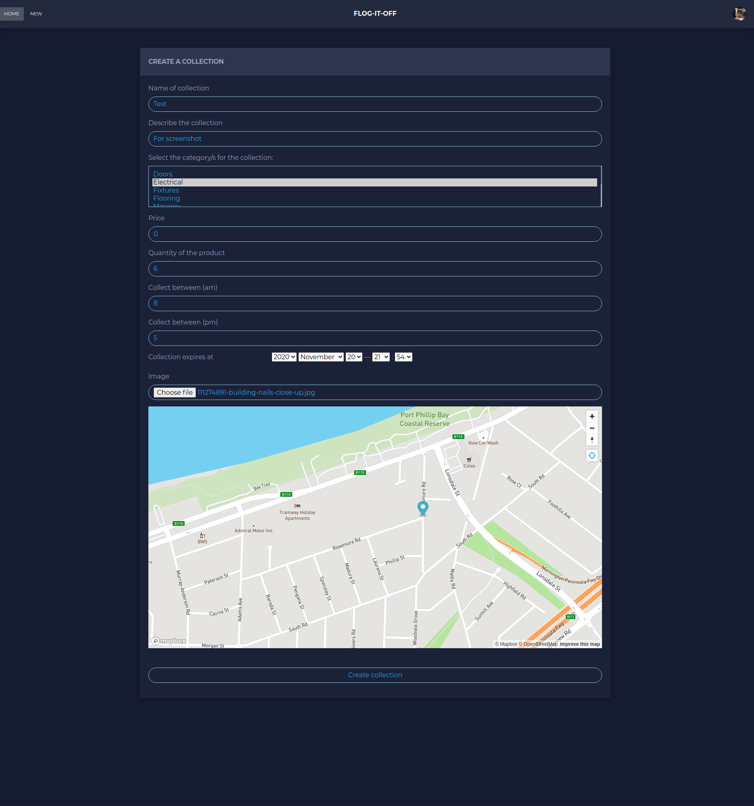
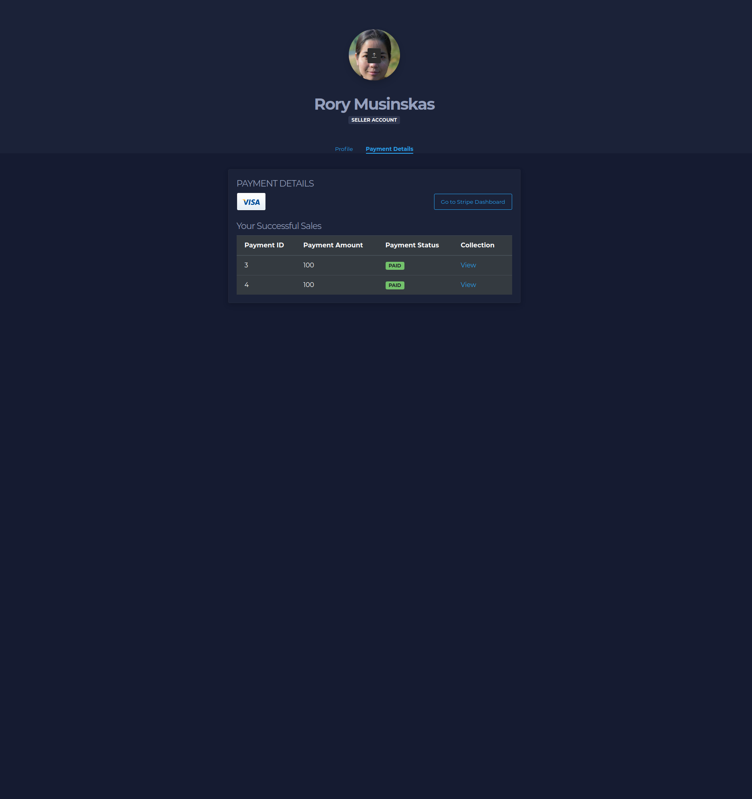

# README

**Identification of the problem you are trying to solve by building this particular marketplace app.**

- In Australia, each year on average, we generate 20 million tonnes of construction waste. A large portion of this 'waste' is generally just a surplus of good condition excess building materials. There is no specific way for trades-people to advertise and give, sell or trade this surplus, which results in perfectly good products/materials going to a waste station. As the world moves to combat global warming, it would be prudent for the construction industry to minimise the amount of waste created and the reproduction of materials which were already made, but are now sitting in landfill.

**Why is it a problem that needs solving?**

- There are already other marketplace apps created, but none of them are specific to the construction industry. Flog it off is built solely around the construction workers which will utilize the app, as the idea of this app revolves around them creating collection points.
- By having a streamlined and specific app, it increases the likelihood of them participating in the minimisation of construction waste. By easily creating a collection and expiry date, the excess products can be collected by people or other builders that may need access to it. This saves users having to trawl through lots of off target searches which are prevalent in general marketplace apps.

**A link (URL) to your deployed app (i.e. website)**

- https://flog-it-off.herokuapp.com/

**A link to your GitHub repository (repo). Ensure the repo is accessible by your Educators**

- https://github.com/RoryMusinskas/flog-it-off

**Description of your marketplace app (website), including:**

- Purpose
  - The purpose of this app is to encourage trades-people to give/sell/trade the surplus building materials which are generated throughout the construction of a project, ultimately to reduce the amount of waste created each year.
- Functionality / features
  - As the app is built around trades-people quickly and easily making a collection of products, it is basic in its development.
    - Trades-people create a collection through a quick form, adding in the required details, including an image and dragging a map marker to where they would like the trade to take place.
    - Users can then see collections near them on an implemented map, they can filter collections by typing and then view each collection.
    - Users are then able to collect or purchase the collection, using stripe, if the collection has a price.
    - Trades-people and Users are able to see their purchases and sales via a profile section in the app.
- Sitemap
  

- Screenshots

  
  
  
  

- **Target audience**

  - The target audience for this application is trades-people with excess/surplus products which they would like to either sell or trade for free and for collectors who are searching for free or cheap products which will be used for their own projects or renovations.

- **Tech stack (e.g. html, css, deployment platform, etc)**

  - Application/data
    - html with embedded ruby
    - css/scss - via kiso themes
    - javascript
    - Ruby
    - Ruby on Rails framework
    - PostgreSQL database
    - Heroku web deployment platform
    - Amazon AWS S3 cloud image storage
    - Devise authentication
    - Bootstrap
    - Mapbox
    - CanCanCan authorization
    - Stripe Payments
    - Twilio SendGrid

- **User stories for your app**

  - As a seller I want to
    - be greeted with a landing page
    - be able to make an account
    - be able to log in and out
    - be able to see all of my current collections listed
    - be able to create a collection of surplus goods
    - be able to add a description to the collection
    - be able to add an optional price for a collection
    - be able to add a quantity of items in a collection
    - be able to add a category/s to the collection
    - be able to add a collection available hours
    - be able to add an expiry date to the collection
    - be able to add a photo to the collection
    - be able to add the collection point by a marker on a map
    - be able to edit a collection
    - be able to delete one of my collections
    - be able to see my expired posts and allow me to repost with a new expiry date
    - be able to receive a payment for a collection if I add a price
    - be able to receive an email when someone purchases one of my collections
    - be able to see all the products I've sold
  - As a buyer I want to
    - be greeted with a landing page
    - be able to make an account
    - be able to log in and out
    - be able to view a map with all available collections shown
    - be able to search for items via a text bar on the map
    - be able to see an optional price for each collection
    - be able to see a quantity for each collection
    - be able to see the category/s for each collection
    - be able to see a description for each collection
    - be able to see the available pickup hours
    - be able to see a photo of each collection
    - be able to see when the collection expires
    - be able to pay through stripe if there is a price
    - be able to confirm collection if there is no price
    - be able to receive an email receipt after collecting/purchasing a collection
    - be able to see all my purchases
  - As a non-logged in user I want to
    - be able to see all available collections on a map
    - be able to see each collection on a show page

- **Wireframes for your app**

- **An ERD for your app**

  - Refer to question 19

- **Explain the different high-level components (abstractions) in your app**

- **Detail any third party services that your app will use**

- **Describe your projects models in terms of the relationships (active record associations) they have with each other**

  The only thing that changed from my initial implementation of my ERD to these models was that I had a whole 'address' table designed in my ERD. But as I was developing, it was obvious it didn't need a whole table dedicated to it and a string stored inside the collection table holding the address was sufficient.

  - Collection -

    - `belongs_to :seller, class_name: 'User', foreign_key: 'seller_id'`- This will reference the users table and if the User has a seller ID, it will add seller_id as the foreign key
    - `has_one :payment`- a collection can only have one payment
    - `has_many :collection_categories, dependent: :destroy`- This is the joining table for the many to many relationship of a collection and categories
    - `has_many :categories, through: :collection_categories`- Each collection can have many categories listed, through the collection_categories joining table
    - `has_one_attached :image`- Each collection will have an attached image, which is stored in the AWS S3 cloud, through active storage

  - User -

    - `has_many :collections, foreign_key: 'seller_id', class_name: 'Collection'`- a User that is a seller, can post many collections and the foreign key will be 'seller_id'
    - `has_many :payments, foreign_key: 'buyer_id', class_name: 'Payment'`- a User that is a buyer, can have many payments and the foreign key will be 'buyer_id'

  - Payments -

    - `belongs_to collection`- a payment will belong to a collection, once a payment is made
    - `belongs_to :buyer, foreign_key: 'buyer_id', class_name: 'User'`- when a payment is made by a buyer User, the associated User id will be the 'buyer_id' foreign_key
    - `belongs_to :seller, foreign_key: 'seller_id', class_name: 'User'`- when a payment is made, the payment also belongs to the user who created the collection

  - CollectionCategory -

    - `belongs_to :collection` - As this is a joining table, it belongs to a collection
    - `belongs_to :category` - As this is a joining table, it belongs to a category

  - Category -

    - `has_many :collection_categories`- This is the joining table for the many to many relationship of a collection and categories
    - `has_many :collections, through: :collection_categories`- Each category can have many collections listed, through the collection_categories joining table

- **Discuss the database relations to be implemented in your application**

  - Collection - This is the main table which will hold all the information for the collection of products that a seller will put up and a buyer will see

    - `Collection` has one `Payment`
    - `Collection` has many `collection_categories`
    - `Collection` has many categories through `collection_categories`

  - **important attributes**

    - available_until - This is a date-time which the seller can pick for when the collection will expire

  - User - This table holds the information for all users in the app, created on signup. They can either be a buyer or a seller role and their experience changes accordingly

    - `User` has many `Payments`, as a `Seller`
    - `User` has many `Payments`, as a `Buyer`
    - `User` has many `Collections`

  - **important attributes**

    - role - this allows a user to choose if they are a buyer or a seller and the app will be presented accordingly to this
    - time_zone - this allows the user to choose their time zone, this will allow for better post expiry accuracy within the app
    - stripe_user_id - once a seller signs up with stripe, their stripe id will be stored in the database, this allows buyers to pay them directly to their account

  - Payments - This table hold the payment data once a successful stripe webhook has been completed. This table allows us to show the successful payments and purchases for users.

    - `Payment` has one `Collection`
    - `Payment` has one `Buyer`
    - `Payment` has one `Seller`

  - CollectionCategory - This is the join table for the many to many relationship between the collection and the category

    - `CollectionCategory` has one `Collection`
    - `CollectionCategory` has one `Category`

  - Category - This table stores the seeded categories for the sellers to select when they are creating a collection and the buyers to see when they are looking at collections

    - `Category` has many `CollectionCategories`
    - `Category` has many `Collections`, through `CollectionCategory`

- **Provide your database schema design**

  - https://dbdiagram.io/d/5fb20ee53a78976d7b7c0613

- **Describe the way tasks are allocated and tracked in your project**
